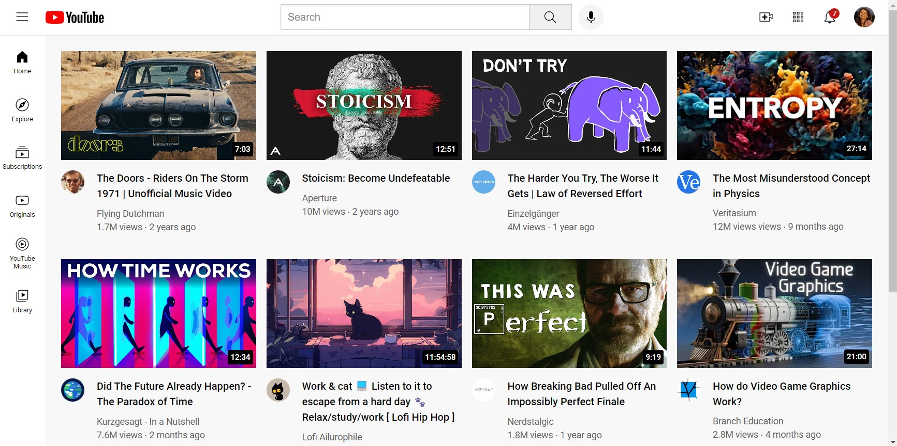
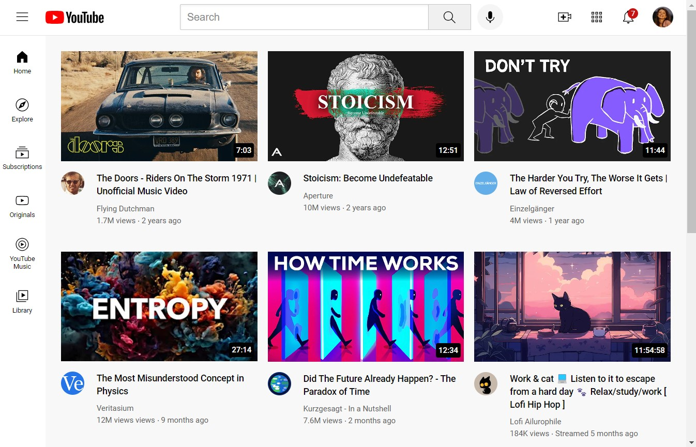
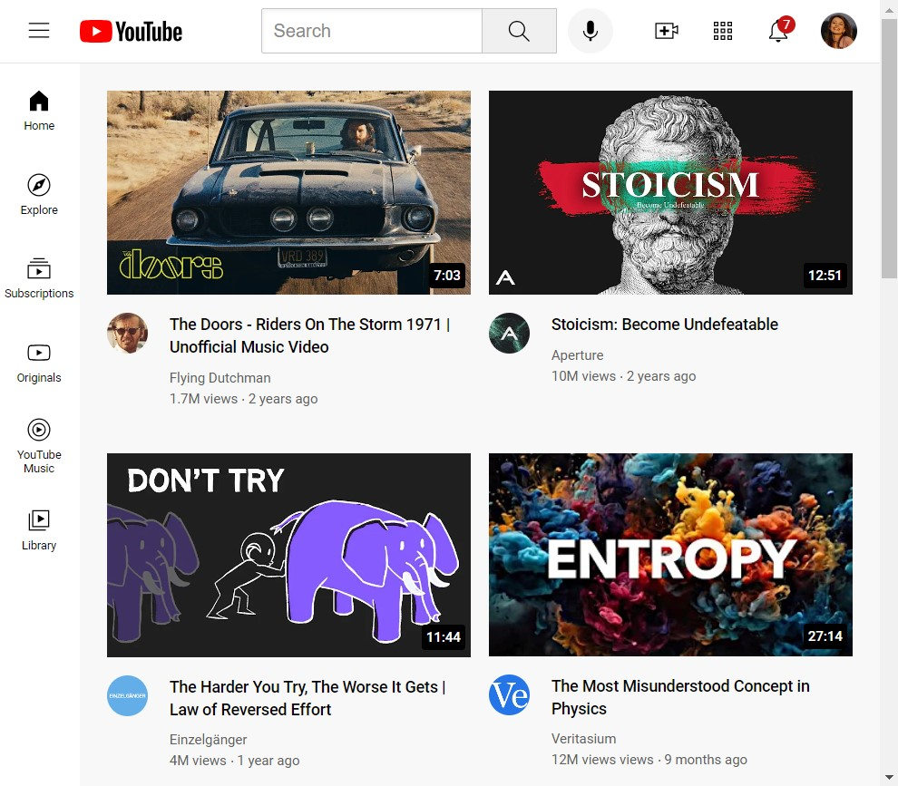
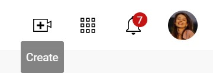
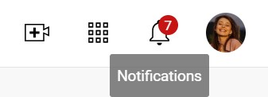
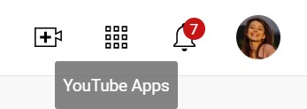

# Project Summary

## Application: My YouTube Clone ##

This project is a HTML and CSS implementation of a **YouTube homepage clone**. 

* My YouTube Clone consists of a static webpage that replicates the visual layout and structure of the YouTube homepage.  
* The header encompasses the logo, search bar, navigation buttons, and user profile picture.  
* Additionally, it includes a sidebar with various sections and a grid layout displaying multiple video previews.  

---

### 🖥️ Responsive Layout: Large Screens ###

**For large screens** _(1100px and wider)_, the layout utilizes a CSS Grid with four columns to display video thumbnails in a grid format.  

<i>What is the importance of it?</i>

>This layout allows for an optimal use of the available screen real estate, providing a visually appealing and organized presentation of video content.  
>The font sizes for video titles, author names, and statistics are also increased to enhance readability and provide a better user experience on larger displays.

 

---

### 📺 Responsive Layout: Medium Screens ###
**On medium-sized screens** _(between 801px and 1099px)_, the layout adjusts to a three-column grid for video thumbnails. 

<i>What is the importance of it?</i>

>This adaptation ensures a balanced and organized display of content while accommodating the reduced screen width.  
>The font sizes remain at their default values, providing a consistent and legible experience across this screen range.

 

---

### ☎️ Responsive Layout: Small Screens ###
**For smaller screens** _(up to 800px wide)_, the layout further adapts by switching to a two-column grid for video thumbnails.

<i>What is the importance of it?</i>

>This compact layout optimizes the use of limited screen space, ensuring that video content remains easily accessible and viewable on smaller devices like tablets and mobile phones.  
>Additionally, the font sizes remain at their default values to maintain readability on these smaller displays.

 

---

### 🔍 Sidebar Navigation ###
The sidebar is a fixed, vertical navigation element positioned on the left side of the screen.  

* It serves as a visual anchor and provides easy access to important sections or features of the website/application.  
* The sidebar items, represented by icons and optional text labels, change color to a light gray shade when hovered over.

<i>What is the importance of it?</i>

>This hover effect creates a subtle visual cue, indicating the currently focused item and enhancing the overall user experience.  
>The consistent placement and visual prominence of the sidebar ensure that users can quickly locate and access essential navigation options, improving usability and engagement.

 

---

### 💡Channel Information ###
The channel information is presented in the form of a tooltip that appears when the user hovers over a video author's profile picture.  

* This tooltip is a crucial element that provides additional context and details about the channel.  
* It includes the channel's name, displayed in a prominent font size and weight, along with the number of subscribers, providing an indication of the channel's popularity and reach.
* Furthermore, the tooltip features the channel's logo or profile picture, adding a visual representation that enhances recognition and brand awareness.

<i>What is the importance of it?</i>

>By presenting this information in a non-intrusive yet easily accessible manner, users can quickly gain insights into the channel's identity and following, aiding in their content discovery and decision-making process.

 

---

### 🎯 Tooltip Appearance ###
Tooltips on the buttons play a crucial role in enhancing user experience and providing contextual information about the functionality of each button. 
* When a user hovers over a button, a small tooltip appears, offering a brief text description that explains the purpose or action associated with that button.
* This behavior is particularly important for buttons that may not be immediately self-explanatory, such as the "YouTube Apps" or "Create" buttons.

<i>What is the importance of it?</i>

>The tooltips are designed to be non-intrusive yet informative.  
>They appear as a small box with a slightly transparent background and white text, ensuring readability while not obscuring the main content.  
>The tooltips are positioned strategically below the buttons, providing a clear connection between the button and its description.

 
 
 
